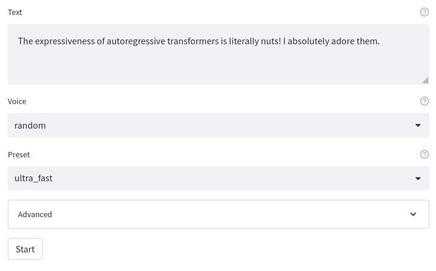
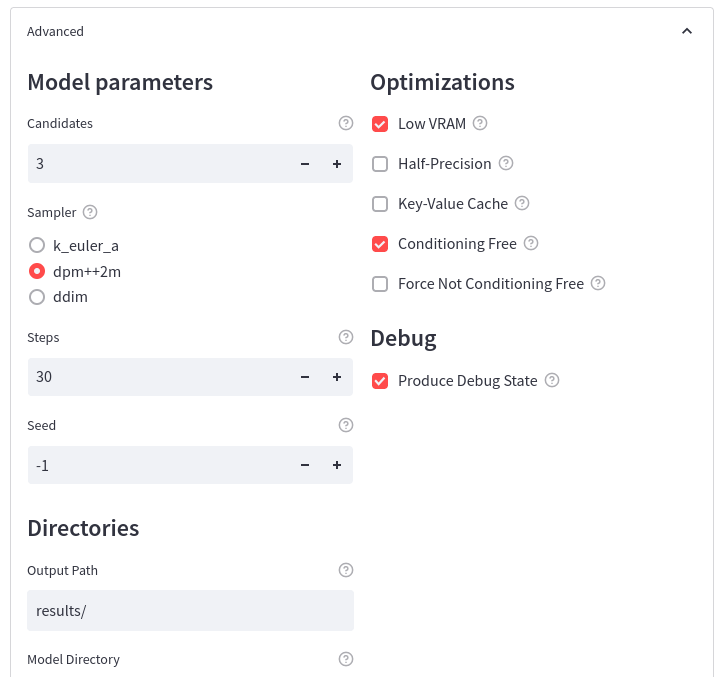

### recent updates
- `--kv_cache` is now **fixed**, and produces outputs **identical to the original tortoise repo**. It is also enabled by default now because of this.
- new: :sparkles: [streamlit webui](#Webui) by @Ryu

[click me](#installation) to skip to installation && usage!

---

# Speeding up TorToiSe inference 5x
This is a working project to drastically boost the performance of TorToiSe, without modifying the base models. **Expect speedups of _5~10x_**, and hopefully 20x or larger when this project is complete.

This repo adds the following config options for TorToiSe for faster inference:
 - [X] (`--kv_cache`) enabling of [KV cache](https://kipp.ly/blog/transformer-inference-arithmetic/#kv-cache) for MUCH faster GPT sampling
 - [X] (`--half`) half precision inference where possible
 - [X] (`--sampler dpm++2m`) [k-diffusion](https://github.com/crowsonkb/k-diffusion) samplers for faster diffusion
 - [X] (disable with `--low_vram`) option to toggle cpu offloading, for high vram users

All changes in this fork are licensed under the **AGPL**. For avoidance beyond all doubt, the [following statement](https://en.wikipedia.org/wiki/Apache_License#Licensing_conditions) is added as a comment to all changed code files:

> `AGPL: a notification must be added stating that changes have been made to that file. `

## Current results
All results listed were generated with a slightly undervolted RTX 3090 on Ubuntu 22.04, with the following base command:

```sh
python tortoise/do_tts.py --voice emma --seed 42 --text "$TEXT"
```

Original TorToiSe [repo](https://github.com/neonbjb/tortoise-tts):
| speed (B) | speed (A) | preset | sample | 
|-|-|-|-|
| 112.81s | 14.94s | ultra_fast | [here](optimized_examples/A/tortoise_original-with_original_vram/) |

New [repo](https://github.com/152334H/tortoise-tts), with `--preset ultra_fast`:
| speed (B) | speed (A) | GPT kv-cache | sampler | cond-free diffusion | autocast to fp16 | samples (vs orig repo) |
|-|-|-|-|-|-|-|
|  118.61   |   11.20   | ❌           | DDIM    | ❌                  | ❌               | [~identical](optimized_examples/A/tortoise_original/) |
|    9.98   |    4.17   | ✅           | DDIM    | ❌                  | ❌               | [~identical](optimized_examples/A/tortoise_original-kv_cache/) |
|    7.51   |    3.26   | ✅           | DPM++2M | ✅                  | ❌               | [**best**](optimized_examples/A/ultra_fast-kv_cache/) |
|    7.12   |    3.30   | ✅           | DPM++2M | ✅                  | ✅               | [okayish](optimized_examples/A/ultra_fast-kv_cache-half/) |
|    7.21   |    3.27   | ✅           | DPM++2M | ❌                  | ✅               | [bad](optimized_examples/A/ultra_fast-kv_cache-half-no_cond_tree/) |

Results measure the time taken to run **`tts.tts_with_preset(...)`** in `do_tts.py`.

The example texts used were:

A (70 characters)
> I'm looking for contributors who can do optimizations better than me.

B (188 characters)
> Then took the other, as just as fair,
>
> And having perhaps the better claim,
>
> Because it was grassy and wanted wear;
>
> Though as for that the passing there
>
> Had worn them really about the same,

Half precision currently significantly worsens outputs, so I do not recommend enabling it unless you are happy with the samples linked. Using `cond_free` with half precision seems to produce decent outputs.

## Installation
The installation process is identical to the original tortoise-tts repo.

```shell
git clone https://github.com/152334H/tortoise-tts.git
cd tortoise-tts
python -m pip install -r ./requirements.txt
python setup.py install
```

Note that if you have the original tortoise installed,
* You will need to uninstall it (`pip uninstall tortoise`)
* You will need to install the new requirements (`pip install -r requirements.txt`)
* You may want to install this repository as a symbolic link (`pip install -e .`), as this repository will be updated frequently

#### pytorch issues
If you are experiencing errors related to GPU usage (or lackthereof), please see the instructions on [the pytorch website](https://pytorch.org/get-started/locally/) to install pytorch with proper GPU support.

## CLI Usage
For maximum speed (and worst quality), you can try:

```sh
python tortoise/do_tts.py --half --no_cond_free --preset ultra_fast --text #...
# or, to only generate 1 sample:
python tortoise/do_tts.py --half --no_cond_free --preset single_sample --candidates 1 --text #...
```

But in most cases, these settings should perform decently && fast:

```sh
python tortoise/do_tts.py --preset ultra_fast --text # ...
```

You can obtain outputs 100% identical to the original tortoise repo with the following command:

```sh
python tortoise/do_tts.py --preset ultra_fast_old --original_tortoise --text #...
```

## Webui
An experimental [Streamlit](https://streamlit.io/) web UI is now available. To access, run:

```bash
$ streamlit run app.py
```





## Future plans
Optimization related:
- [ ] add more k-diffusion samplers; optimize diffusion step count
- [ ] **fix KV cache** implementation
- [ ] **add TensorRT model**. 90% of inference time is spent in the GPT model; compiling it should produce great speedups, but it requires:
    - [ ] a less hacky `transformers` model definition (see `GPT2InferenceModel`)
    - [ ] an ORTModelForCausalLM implementation for tortoise
    - [ ] tensorRT runtime
- [ ] try half precision in the vocoder + diffuser

QoL related:
- [ ] display samples on github pages, where you can do audio embeddings
- [ ] implement new args in places other than ./tortoise/do_tts.py
- [ ] fix api usage with new args
- [ ] webui integration???

## Motivation
As stated by an [11Labs](https://beta.elevenlabs.io) developer:


Original README description:

---

# TorToiSe

Tortoise is a text-to-speech program built with the following priorities:

1. Strong multi-voice capabilities.
2. Highly realistic prosody and intonation.

This repo contains all the code needed to run Tortoise TTS in inference mode.

A (*very*) rough draft of the Tortoise paper is now available in doc format. I would definitely appreciate any comments, suggestions or reviews:
https://docs.google.com/document/d/13O_eyY65i6AkNrN_LdPhpUjGhyTNKYHvDrIvHnHe1GA

### Version history

#### v2.4; 2022/5/17
- Removed CVVP model. Found that it does not, in fact, make an appreciable difference in the output.
- Add better debugging support; existing tools now spit out debug files which can be used to reproduce bad runs.

#### v2.3; 2022/5/12
- New CLVP-large model for further improved decoding guidance.
- Improvements to read.py and do_tts.py (new options)

#### v2.2; 2022/5/5
- Added several new voices from the training set.
- Automated redaction. Wrap the text you want to use to prompt the model but not be spoken in brackets.
- Bug fixes

#### v2.1; 2022/5/2
- Added ability to produce totally random voices.
- Added ability to download voice conditioning latent via a script, and then use a user-provided conditioning latent.
- Added ability to use your own pretrained models.
- Refactored directory structures.
- Performance improvements & bug fixes.

## What's in a name?

I'm naming my speech-related repos after Mojave desert flora and fauna. Tortoise is a bit tongue in cheek: this model
is insanely slow. It leverages both an autoregressive decoder **and** a diffusion decoder; both known for their low
sampling rates. On a K80, expect to generate a medium sized sentence every 2 minutes.

## Demos

See [this page](http://nonint.com/static/tortoise_v2_examples.html) for a large list of example outputs.

Cool application of Tortoise+GPT-3 (not by me): https://twitter.com/lexman_ai

## Usage guide

### Colab

Colab is the easiest way to try this out. I've put together a notebook you can use here:
https://colab.research.google.com/drive/1wVVqUPqwiDBUVeWWOUNglpGhU3hg_cbR?usp=sharing

### Local Installation

If you want to use this on your own computer, you must have an NVIDIA GPU.

First, install pytorch using these instructions: [https://pytorch.org/get-started/locally/](https://pytorch.org/get-started/locally/).
On Windows, I **highly** recommend using the Conda installation path. I have been told that if you do not do this, you
will spend a lot of time chasing dependency problems.

Next, install TorToiSe and it's dependencies:

```shell
git clone https://github.com/neonbjb/tortoise-tts.git
cd tortoise-tts
python -m pip install -r ./requirements.txt
python setup.py install
```

If you are on windows, you will also need to install pysoundfile: `conda install -c conda-forge pysoundfile`

### do_tts.py

This script allows you to speak a single phrase with one or more voices.
```shell
python tortoise/do_tts.py --text "I'm going to speak this" --voice random --preset fast
```

### read.py

This script provides tools for reading large amounts of text.

```shell
python tortoise/read.py --textfile <your text to be read> --voice random
```

This will break up the textfile into sentences, and then convert them to speech one at a time. It will output a series
of spoken clips as they are generated. Once all the clips are generated, it will combine them into a single file and
output that as well.

Sometimes Tortoise screws up an output. You can re-generate any bad clips by re-running `read.py` with the --regenerate
argument.

### API

Tortoise can be used programmatically, like so:

```python
reference_clips = [utils.audio.load_audio(p, 22050) for p in clips_paths]
tts = api.TextToSpeech()
pcm_audio = tts.tts_with_preset("your text here", voice_samples=reference_clips, preset='fast')
```

## Voice customization guide

Tortoise was specifically trained to be a multi-speaker model. It accomplishes this by consulting reference clips.

These reference clips are recordings of a speaker that you provide to guide speech generation. These clips are used to determine many properties of the output, such as the pitch and tone of the voice, speaking speed, and even speaking defects like a lisp or stuttering. The reference clip is also used to determine non-voice related aspects of the audio output like volume, background noise, recording quality and reverb.

### Random voice

I've included a feature which randomly generates a voice. These voices don't actually exist and will be random every time you run
it. The results are quite fascinating and I recommend you play around with it!

You can use the random voice by passing in 'random' as the voice name. Tortoise will take care of the rest.

For the those in the ML space: this is created by projecting a random vector onto the voice conditioning latent space.

### Provided voices

This repo comes with several pre-packaged voices. Voices prepended with "train_" came from the training set and perform
far better than the others. If your goal is high quality speech, I recommend you pick one of them. If you want to see
what Tortoise can do for zero-shot mimicking, take a look at the others.

### Adding a new voice

To add new voices to Tortoise, you will need to do the following:

1. Gather audio clips of your speaker(s). Good sources are YouTube interviews (you can use youtube-dl to fetch the audio), audiobooks or podcasts. Guidelines for good clips are in the next section.
2. Cut your clips into ~10 second segments. You want at least 3 clips. More is better, but I only experimented with up to 5 in my testing.
3. Save the clips as a WAV file with floating point format and a 22,050 sample rate.
4. Create a subdirectory in voices/
5. Put your clips in that subdirectory.
6. Run tortoise utilities with --voice=<your_subdirectory_name>.

### Picking good reference clips

As mentioned above, your reference clips have a profound impact on the output of Tortoise. Following are some tips for picking
good clips:

1. Avoid clips with background music, noise or reverb. These clips were removed from the training dataset. Tortoise is unlikely to do well with them.
2. Avoid speeches. These generally have distortion caused by the amplification system.
3. Avoid clips from phone calls.
4. Avoid clips that have excessive stuttering, stammering or words like "uh" or "like" in them.
5. Try to find clips that are spoken in such a way as you wish your output to sound like. For example, if you want to hear your target voice read an audiobook, try to find clips of them reading a book.
6. The text being spoken in the clips does not matter, but diverse text does seem to perform better.

## Advanced Usage

### Generation settings

Tortoise is primarily an autoregressive decoder model combined with a diffusion model. Both of these have a lot of knobs
that can be turned that I've abstracted away for the sake of ease of use. I did this by generating thousands of clips using
various permutations of the settings and using a metric for voice realism and intelligibility to measure their effects. I've
set the defaults to the best overall settings I was able to find. For specific use-cases, it might be effective to play with
these settings (and it's very likely that I missed something!)

These settings are not available in the normal scripts packaged with Tortoise. They are available, however, in the API. See
```api.tts``` for a full list.

### Prompt engineering

Some people have discovered that it is possible to do prompt engineering with Tortoise! For example, you can evoke emotion
by including things like "I am really sad," before your text. I've built an automated redaction system that you can use to
take advantage of this. It works by attempting to redact any text in the prompt surrounded by brackets. For example, the
prompt "\[I am really sad,\] Please feed me." will only speak the words "Please feed me" (with a sad tonality).

### Playing with the voice latent

Tortoise ingests reference clips by feeding them through individually through a small submodel that produces a point latent,
then taking the mean of all of the produced latents. The experimentation I have done has indicated that these point latents
are quite expressive, affecting everything from tone to speaking rate to speech abnormalities.

This lends itself to some neat tricks. For example, you can combine feed two different voices to tortoise and it will output
what it thinks the "average" of those two voices sounds like.

#### Generating conditioning latents from voices

Use the script `get_conditioning_latents.py` to extract conditioning latents for a voice you have installed. This script
will dump the latents to a .pth pickle file. The file will contain a single tuple, (autoregressive_latent, diffusion_latent).

Alternatively, use the api.TextToSpeech.get_conditioning_latents() to fetch the latents.

#### Using raw conditioning latents to generate speech

After you've played with them, you can use them to generate speech by creating a subdirectory in voices/ with a single
".pth" file containing the pickled conditioning latents as a tuple (autoregressive_latent, diffusion_latent).

### Send me feedback!

Probabilistic models like Tortoise are best thought of as an "augmented search" - in this case, through the space of possible
utterances of a specific string of text. The impact of community involvement in perusing these spaces (such as is being done with
GPT-3 or CLIP) has really surprised me. If you find something neat that you can do with Tortoise that isn't documented here,
please report it to me! I would be glad to publish it to this page.

## Tortoise-detect

Out of concerns that this model might be misused, I've built a classifier that tells the likelihood that an audio clip
came from Tortoise.

This classifier can be run on any computer, usage is as follows:

```commandline
python tortoise/is_this_from_tortoise.py --clip=<path_to_suspicious_audio_file>
```

This model has 100% accuracy on the contents of the results/ and voices/ folders in this repo. Still, treat this classifier
as a "strong signal". Classifiers can be fooled and it is likewise not impossible for this classifier to exhibit false
positives.

## Model architecture

Tortoise TTS is inspired by OpenAI's DALLE, applied to speech data and using a better decoder. It is made up of 5 separate
models that work together. I've assembled a write-up of the system architecture here:
[https://nonint.com/2022/04/25/tortoise-architectural-design-doc/](https://nonint.com/2022/04/25/tortoise-architectural-design-doc/)

## Training

These models were trained on my "homelab" server with 8 RTX 3090s over the course of several months. They were trained on a dataset consisting of
~50k hours of speech data, most of which was transcribed by [ocotillo](http://www.github.com/neonbjb/ocotillo). Training was done on my own
[DLAS](https://github.com/neonbjb/DL-Art-School) trainer.

I currently do not have plans to release the training configurations or methodology. See the next section..

## Ethical Considerations

Tortoise v2 works considerably better than I had planned. When I began hearing some of the outputs of the last few versions, I began
wondering whether or not I had an ethically unsound project on my hands. The ways in which a voice-cloning text-to-speech system
could be misused are many. It doesn't take much creativity to think up how.

After some thought, I have decided to go forward with releasing this. Following are the reasons for this choice:

1. It is primarily good at reading books and speaking poetry. Other forms of speech do not work well.
2. It was trained on a dataset which does not have the voices of public figures. While it will attempt to mimic these voices if they are provided as references, it does not do so in such a way that most humans would be fooled.
3. The above points could likely be resolved by scaling up the model and the dataset. For this reason, I am currently withholding details on how I trained the model, pending community feedback.
4. I am releasing a separate classifier model which will tell you whether a given audio clip was generated by Tortoise or not. See `tortoise-detect` above.
5. If I, a tinkerer with a BS in computer science with a ~$15k computer can build this, then any motivated corporation or state can as well. I would prefer that it be in the open and everyone know the kinds of things ML can do.

### Diversity

The diversity expressed by ML models is strongly tied to the datasets they were trained on.

Tortoise was trained primarily on a dataset consisting of audiobooks. I made no effort to
balance diversity in this dataset. For this reason, Tortoise will be particularly poor at generating the voices of minorities
or of people who speak with strong accents.

## Looking forward

Tortoise v2 is about as good as I think I can do in the TTS world with the resources I have access to. A phenomenon that happens when
training very large models is that as parameter count increases, the communication bandwidth needed to support distributed training
of the model increases multiplicatively. On enterprise-grade hardware, this is not an issue: GPUs are attached together with
exceptionally wide buses that can accommodate this bandwidth. I cannot afford enterprise hardware, though, so I am stuck.

I want to mention here
that I think Tortoise could do be a **lot** better. The three major components of Tortoise are either vanilla Transformer Encoder stacks
or Decoder stacks. Both of these types of models have a rich experimental history with scaling in the NLP realm. I see no reason
to believe that the same is not true of TTS.

The largest model in Tortoise v2 is considerably smaller than GPT-2 large. It is 20x smaller that the original DALLE transformer.
Imagine what a TTS model trained at or near GPT-3 or DALLE scale could achieve.

If you are an ethical organization with computational resources to spare interested in seeing what this model could do
if properly scaled out, please reach out to me! I would love to collaborate on this.

## Acknowledgements

This project has garnered more praise than I expected. I am standing on the shoulders of giants, though, and I want to
credit a few of the amazing folks in the community that have helped make this happen:

- Hugging Face, who wrote the GPT model and the generate API used by Tortoise, and who hosts the model weights.
- [Ramesh et al](https://arxiv.org/pdf/2102.12092.pdf) who authored the DALLE paper, which is the inspiration behind Tortoise.
- [Nichol and Dhariwal](https://arxiv.org/pdf/2102.09672.pdf) who authored the (revision of) the code that drives the diffusion model.
- [Jang et al](https://arxiv.org/pdf/2106.07889.pdf) who developed and open-sourced univnet, the vocoder this repo uses.
- [Kim and Jung](https://github.com/mindslab-ai/univnet) who implemented univnet pytorch model.
- [lucidrains](https://github.com/lucidrains) who writes awesome open source pytorch models, many of which are used here.
- [Patrick von Platen](https://huggingface.co/patrickvonplaten) whose guides on setting up wav2vec were invaluable to building my dataset.

## Notice

Tortoise was built entirely by me using my own hardware. My employer was not involved in any facet of Tortoise's development.

If you use this repo or the ideas therein for your research, please cite it! A bibtex entree can be found in the right pane on GitHub.
